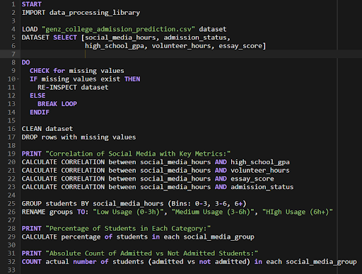
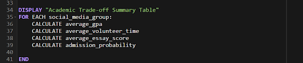
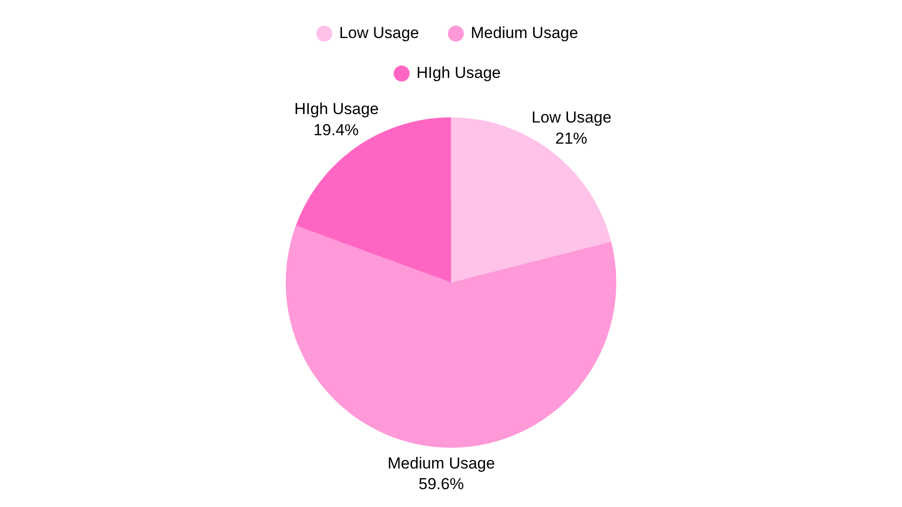
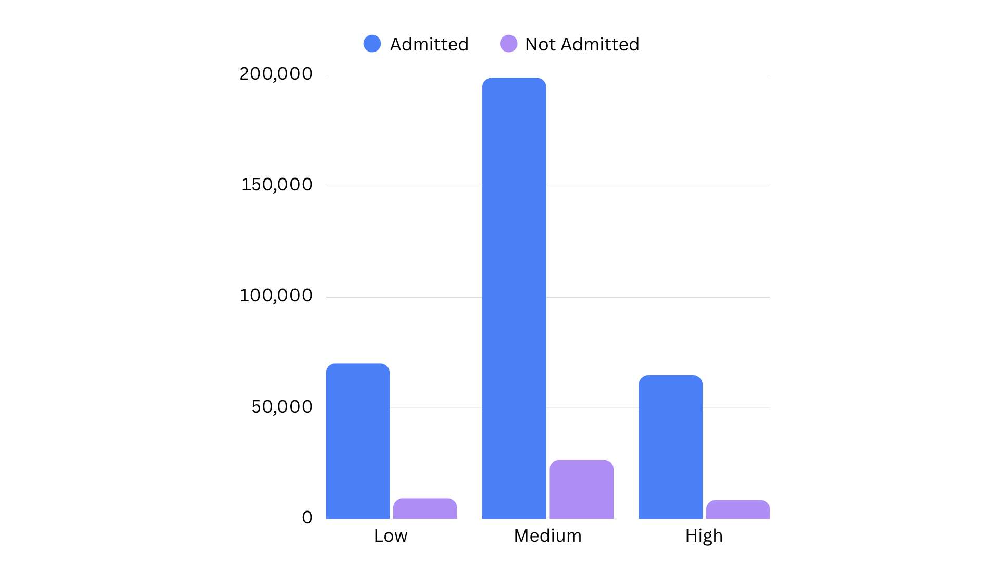
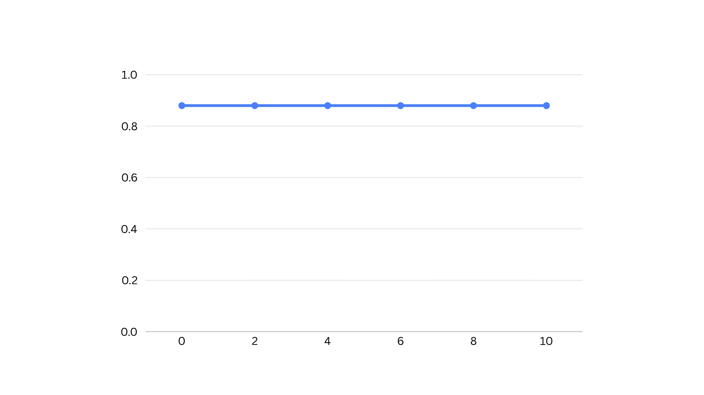
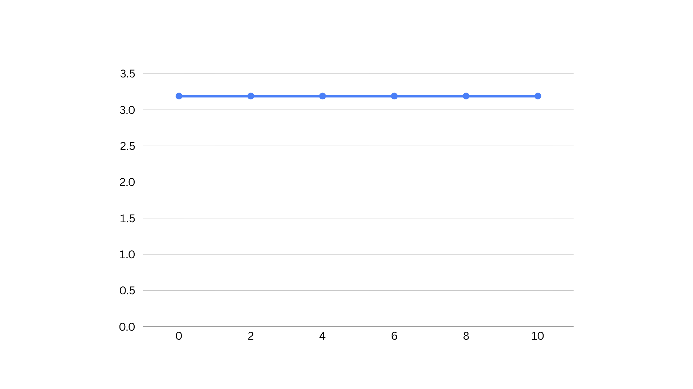
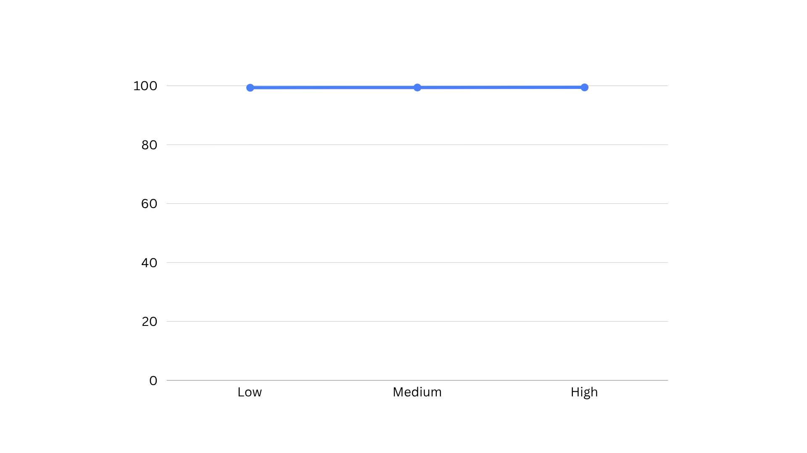
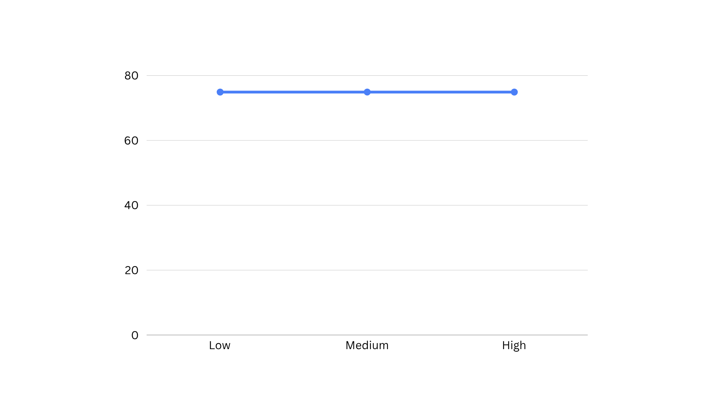

**DSCP Final Project**  
**41406125E 郭虹秀 [41406125e@gapps.ntnu.edu.tw](mailto:41406125e@gapps.ntnu.edu.tw)**

### **1. Short sentences addressing the objective(s)**  

This research project investigates the correlation between daily social media usage and university admission success by analyzing how digital habits influence the students academic performance and extracurricular engagement. By utilizing a dataset of 1,000,000 students, the study aims to validate an academic trade-off hypothesis, where higher social\_media\_hours may lead to a decrease in high\_school\_gpa and volunteer\_hours. The research also explores the impact of digital consumption on subjective admission criteria like the essay\_score, identifying whether excessive social media time begins to noticeably decrease a candidate's probability of admission\_status. 

### **Dataset**  

The **Gen-Z College Admission Prediction Dataset** is a large-scale synthetic dataset designed to model the college admission process for modern Generation Z students. The dataset contains **1,000,000 student records** and will be used as a database for this assignment.

[https://www.kaggle.com/datasets/sharmajicoder/genn-z-college-admission-dataset/data](https://www.kaggle.com/datasets/sharmajicoder/genn-z-college-admission-dataset/data)

### **2. Pseudocode and/or flowchart**    
     
     
     

### **3. At least one visualization**  

The pie chart reveals that the vast majority of the 1,000,000 surveyed students fall into the Medium Usage (3-6h) category at 59.58%, while Low Users (0-3h) and High Users (6h+) constitute 21.02% and 19.40%.   
  

Then, the bar chart shown across all three user groups, the volume of admitted students massively eclipses those who were not admitted, which maintains a completely identical proportional ratio regardless of screen time. 

  

### 

**1\. Social Media Hours vs. Admission Probability**

This plot tests the hypothesis whether increasing social media time decreases a student's chances of getting into college. The data shows that the probability of admission remains constant at approximately 0.88 (88%) across all groups.
  

**2\. Social Media Hours vs. High School GPA**

### This plot tests the hypothesis whether excessive screen time degrades academic focus. The data shows that the average GPA stays locked at 3.18 regardless of digital consumption.

**3\. Social Media Hours vs. Volunteer Time** 

This plot tests the hypothesis whether heavy social media users will have significantly fewer volunteer hours due to time displacement. The data shown for volunteer hours remains completely flat at \~99.4 hours, showing no deviation regardless of the student's screen time.   

**4\. Social Media Hours vs. Essay Score** 

This plot tests the hypothesis whether high screen time correlates with reduced cognitive focus, leading to lower-quality application essays and depressed scores. The essay score sits constantly at a mean of \~74.9 points out of 100 across all behavioral groups. 

**5\. Academic Trade Off Summary Table**

| Social Media Group | Average GPA  | Average Volunteer Time  | Average Essay Score  | Admission Probability   |
| :---: | :---: | :---: | :---: | :---: |
| **Low Usage (0-3h)**  | 3.190754  | 99.348858  | 74.895690  | 0.881631  |
| **Medium Usage (3-6h)**  | 3.189436  | 99.397645  | 74.906420  | 0.881649  |
| **High Usage (6h+)**  | 3.188249  | 99.448151  | 74.904716  | 0.882449  |

### **Conclusion**

Based on the analysis over the dataset of 1,000,000 students, the Academic Trade-off Hypothesis is **rejected**. The evidence demonstrates that daily social media usage behaves as a completely neutral variable within this population, as proven by correlation coefficient of exactly **0.00** across all academic performance and admission vectors. When segmented into low, medium, and high digital usage, the conditional means for all performance metrics remained completely stagnant, showing an average GPA locked at **\~3.19**, extracurricular community service stable at **\~99.4 hours**, and standardized essay scores at **\~74.9 out of 100**. This absolute lack of statistical variance indicates that heavy digital screen time does not displace structured academic activities or degrade a student's cognitive and qualitative writing capabilities. Lastly, the probability of university admission is a horizontal of a success rate of **\~88%**, showing an identical proportional ratio of admitted versus rejected students regardless of screen time.

### **4. Upload the notebook to GitHub and create a GitHub page** 

Please find the project files at:

[https://github.com/caithlynatalie/genz-admission-analysis](https://github.com/caithlynatalie/genz-admission-analysis)
